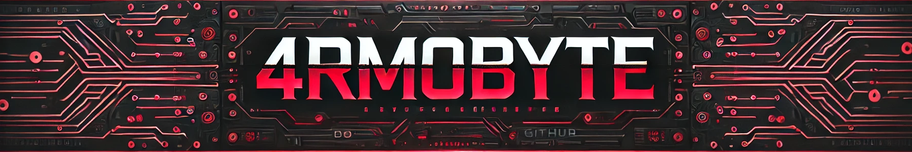

<h1 align="center">Welcome to 4rm0Byte! 👋</h1>
<br>

<p align="center">
  
</p>

<div align="center">

[](LICENSE)

[](https://github.com/gohugoio/hugo/releases/tag/0.157.0)
[](https://nodejs.org/)
[](https://go.dev/)

[](https://github.com/Armoghan-Blogs/4rm0Byte/stargazers)
[](https://github.com/Armoghan-Blogs/4rm0Byte)
[](https://github.com/Armoghan-Blogs/4rm0Byte/commits)


</div>

## 📖 About
Welcome to **4rm0Byte** — my personal blog about software development, tooling, and open-source. This site is built with [Hugo](https://gohugo.io/), [Blow Fish Theme](https://github.com/nunocoracao/blowfish/), [Decap CMS](https://decapcms.org/) and powered by Go and Node tooling.

---

## 🚀 Quick start (local)

- Install and use Node with fnm:
  ```bash
  fnm install 22.22.1
  fnm use 22.22.1
  ```
- Install JS deps:
  ```bash
  npm install
  # or
  pnpm install
  ```
- Prepare Go & Hugo modules:
  ```bash
  go mod tidy
  hugo mod get -u
  ```
- Run local dev server:
  ```bash
  hugo server -D
  # or if using a frontend script
  npm run dev
  ```

---

## 🛠️ Technologies Used

- [x] **Hugo**: Static site generator (uses Hugo modules)
- [x] **Blow Fish Theme**: Hugo theme (as a Hugo module)
- [x] **Decap CMS**: Content management system
- [x] **fnm** (Fast Node Manager): per-project Node version management
- [x] **Node.js (v22.22.1)**: JavaScript runtime used for local tooling
- [x] **Go (go1.26.0)**: Build/runtime for Hugo and CLI tools
- [x] **Go modules** (`go mod`): Go dependency management
- [x] **Hugo modules**: theme and module management for Hugo
- [x] **npm / pnpm**: JS package managers (scripts, builds)
- [x] **CI / Actions**: GitHub Actions (recommended for builds and deploys)

---

## 🤝 Contributing

We welcome contributions to improve the Winfig setup experience! Here's how you can help:

### How to Contribute
1.  **Fork** this repository
2.  **Create** a feature branch (`git checkout -b feature/amazing-feature`)
3.  **Make** your changes with clear, descriptive commits
4.  **Push** to your branch (`git push origin feature/amazing-feature`)
5.  **Submit** a Pull Request with a detailed description

### Contribution Guidelines
- Follow existing code style and conventions
- Test your changes thoroughly
- Update documentation if needed
- Keep commits focused and atomic

---

## 📜 License

This project is licensed under the MIT License. See the [LICENSE](https://github.com/Armoghan-Blogs/4rm0Byte/blob/main/LICENSE) file for details.

---

## 📧 Contact

📩 For any inquiries, please contact me at [armoghanblogs@gmail.com](mailto:armoghanblogs@gmail.com).

💻 Follow me on [GitHub](https://github.com/Armoghan-ul-Mohmin) for updates!
