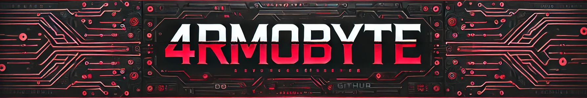

<h1 align="center">Welcome to 4rm0Byte! 👋</h1>
 

  

### Table of Contents

- [📖 About](#-about)
- [🛠️ Technologies Used](#️-technologies-used)
- [📜 License](#-license)
- [📧 Contact](#-contact)

## 📖 About

Welcome to **4rm0Byte**! This is my personal blogging website.

## 🛠️ Technologies Used

- **[Hugo](https://gohugo.io/)**: Static site generator
- **[Decap CMS](https://decapcms.org/)**: Content management system
- **[Tailwind CSS](https://tailwindcss.com/)**: Utility-first CSS framework

## 📜 License

This project is licensed under the Creative Commons Attribution-NonCommercial-NoDerivatives 4.0 International License. See the [LICENSE](https://github.com/Armoghan-Blogs/4rm0Byte/blob/main/LICENSE) file for details.

## 📧 Contact

📩 For any inquiries, please contact me at [armoghanblogs@gmail.com](mailto:armoghanblogs@gmail.com).

💻 Follow me on [GitHub](https://github.com/Armoghan-ul-Mohmin) for updates!